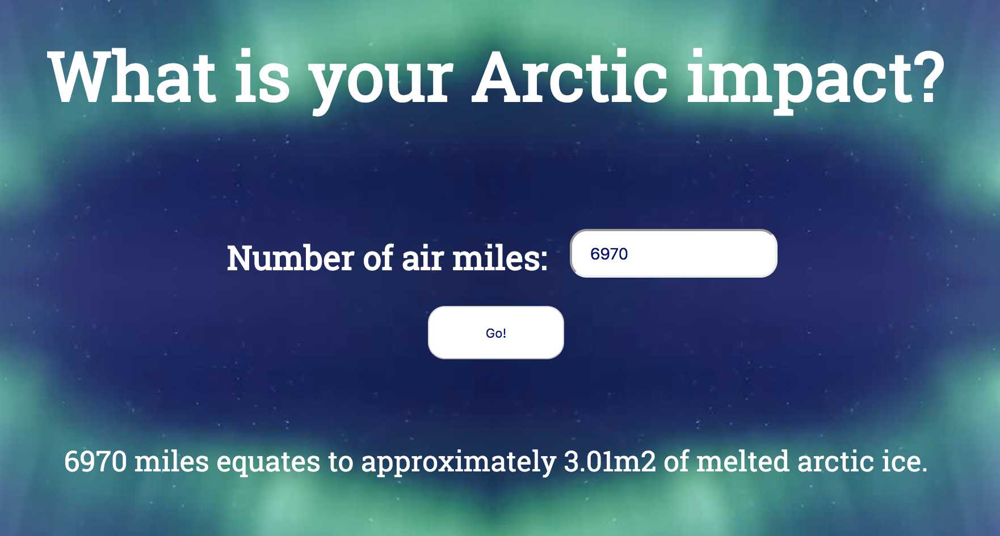

# Arctic Calculator

August 2019

The Arctic Calculator is a simple concept which allows us to calculate the impact of our air miles on the Arctic circle. It is an environmental awareness project, created as part of Impact Makers' Fixathon.

Impact Makers is an open community trying to find tech solutions to environmental issues. The Fixathon (2-30 August 2019) is an online hackathon to help fix the climate. It is a chance for the community to make a collective, concentrated and focused effort to contribute positively to the cause.

Arctic Calculator was inspired by David Wallace-Wells' 'Unihabitable Earth' - a brutal portrait of climate change and our future lives on Earth. One quote in particular stood out to me.

"Every round-trip ticket on flights from New York to London . . . costs the Arctic three more square meters of ice."

My name is Sophie Fitzpatrick, and I'm a London based Junior Backend Engineer, programming primarily in Python. For Arctic Calculator I learnt some Javascript, and dusted off some rusty HTML and CSS skills.

Feel free to contact me on Twitter @srfitzpatrick_

